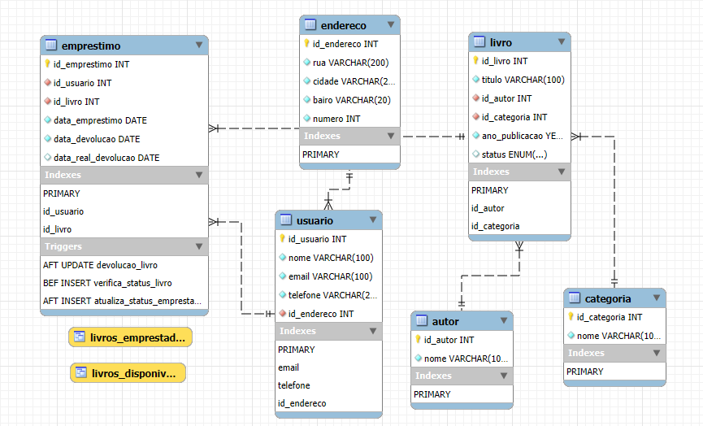

# 📚 Sistema de Gerenciamento de Biblioteca

## Descrição do Projeto
Este projeto consiste em um modelo de banco de dados para o gerenciamento de uma biblioteca, permitindo o controle de livros, usuários, autores, categorias, endereços e empréstimos de forma eficiente.

## 📂 Estrutura do Projeto

- **`biblioteca.mwb`**: Arquivo do MySQL Workbench contendo o modelo visual do banco de dados.
- **`biblioteca.sql`**: Script de criação das tabelas e relacionamentos do banco de dados.
- **`insert.sql`**: Script de inserção de dados de exemplo no banco de dados.
- **`diagram.png`**: Imagem do diagrama Entidade-Relacionamento (ER).

## 🗂️ Tabelas do Banco de Dados

- **usuario**: Armazena informações dos usuários (nome, email, telefone, endereço).
- **endereco**: Contém os dados de endereço dos usuários.
- **livro**: Registra informações sobre os livros (título, autor, categoria, ano de publicação e status).
- **autor**: Cadastro de autores dos livros.
- **categoria**: Cadastro de categorias dos livros.
- **emprestimo**: Controle de empréstimos de livros para os usuários.

## 🔗 Relacionamentos

- Um **usuário** está vinculado a um **endereço**.
- Um **livro** pertence a uma **categoria** e a um **autor**.
- Um **empréstimo** liga um **usuário** a um **livro**.

## ⚙️ Funcionalidades Especiais

- **Triggers**:
  - Atualização do status de um livro quando emprestado ou devolvido.
  - Verificação do status do livro antes de realizar o empréstimo.
  - Atualização do status do empréstimo conforme a devolução.

- **Views**:
  - `livros_emprestados`: Visualiza todos os livros que estão atualmente emprestados.
  - `livros_disponiveis`: Visualiza todos os livros disponíveis para empréstimo.

## 🛠️ Como utilizar

1. **Clone o repositório:**

   ```bash
   git clone https://github.com/vitormunnizz/biblioteca.git
   ```

2. **Importe o banco de dados:**

   - No MySQL Workbench ou outro cliente MySQL:
     - Execute o script `biblioteca.sql` para criar o esquema.
     - Execute o script `insert.sql` para inserir dados de exemplo.

3. **Explore o modelo:**

   - Utilize o arquivo `biblioteca.mwb` para visualizar o diagrama completo no MySQL Workbench.
   - Consulte a imagem `diagram.png` para ter uma visão rápida do modelo ER.

## 🖼️ Diagrama



## 📄 Contato
Para dúvidas ou sugestões, entre em contato pelo e-mail: vitormunnizz@gmail.com.
